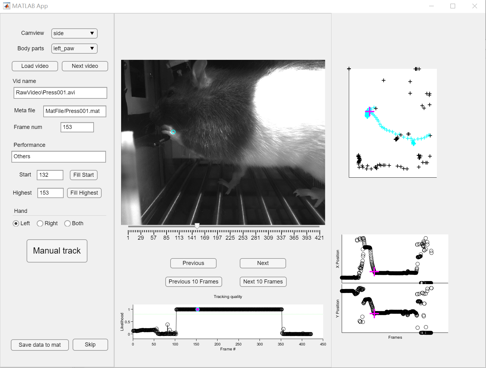
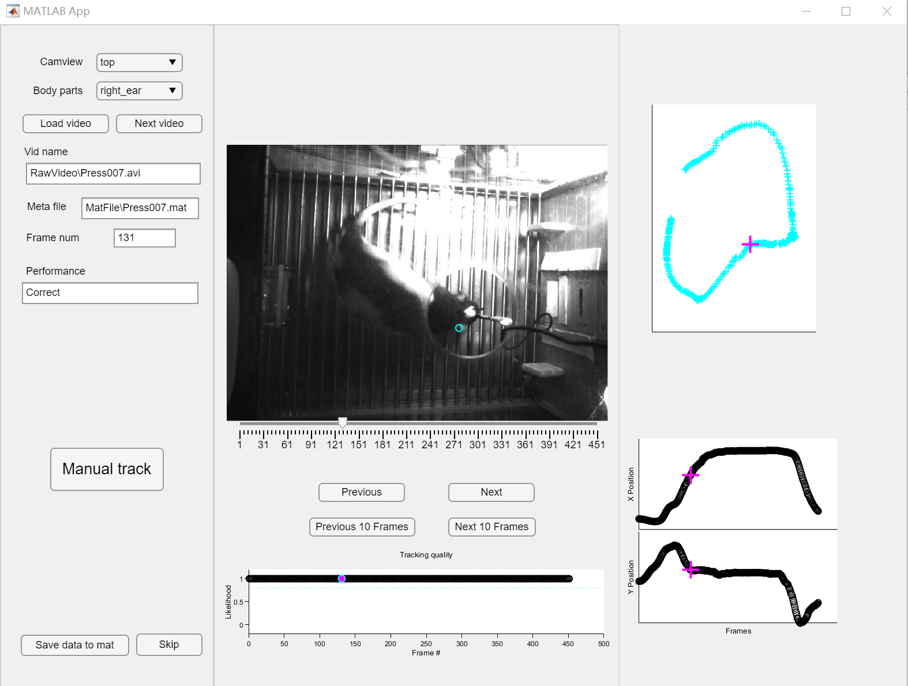
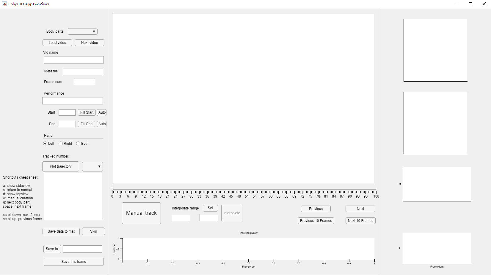
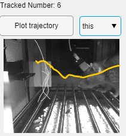
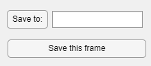
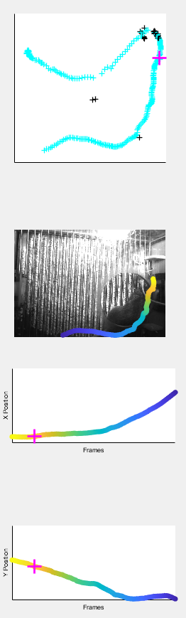

# EphysDLCApp
- Manually curate DeepLabCut output for video tracking.
- Label the hand that presses the lever.
- Label the lift-start frames.

## Usage
- Change directory to `./VideoFrame_camview/`
- Run `EphysDLCApp.mlapp` to start the app.

- Instructions:
  - Load Video: start this app by load a video in `./VideoFrame_camview/RawVideo`
  - Next Video: save data to mat and load next "Correct" video
  - Fill Start: pick the frame number when the rat starts to lift its hand
  - Fill Highest: pick the frame number when the rat's hand is highest
  - Hand: choose the hand that the rat first lifts
  - Manual Check: manually modify the tracking by clicking on the image
  - Save data to mat: save to `./VideoFrame_camview/MatFile/`
  - Skip: save the data but set the isGoodTracking to false and move to next "Correct" video
- The curated information is stored in the corresponding `.mat` file.
- Copy the `updateVideoInfos.m` to the video folder. Edit the `camview` and run to update `r`.

## Output
### Updated `Press*.mat` in the `./VideoFrame_camview/MatFile/`

### Updated `r`
- r

| Field name | Description |
| --- | --- |
| VideoInfo_top | The video information from the top view |
| VideoInfo_side | The video information from the side view |

- r.VideoInfo_side

| Field name | Description |
| --- | --- |
| AnimalName | The name of the animal |
| SessionName | The name of the session (e.g., 20230923) |
| Event | The event that used to make video clips (e.g., "Press") |
| Index | The index of the trial |
| Cue | Whether there is a cue in the trial |
| Time | The event time of the trial (e.g., the press time of the trial) |
| Foreperiod | The foreperiod of the trial |
| ReactTime | The react time of the trial |
| t_pre | The time of the first frame relative to the event time |
| t_post | The time of the last frame relative to the event time |
| total_frames | The total number of frames |
| Performance | The performance of the trial ("Correct", "Premature", "Late" or "Others") |
| VideoFilename | The filename of the corresonding video |
| VideoFrameIndex | The frame index in the total frames (.seq videos) of the video clip |
| VideoFrameTime | The frame time in `r` |
| Units | The recorded units and their spike times in the trial |
| isGoodTracking | Whether the tracking is good |
| Hand | The hand that the rat used to press the lever ("Left", "Right" or "Both)|
| LiftStartFrameNum | The frame number in the video clip when the rat starts to lift its hand |
| LiftStartTime | The time in `r` when the rat starts to lift its hand |
| LiftHighestFrameNum | The frame number in the video clip when the rat's hand is highest |
| LiftHighestTime | The time in `r` when the rat's hand is highest |
| Tracking | The tracking data from DeepLabCut after manually curated |

- r.VideoInfo_side.Tracking

| Field name | Description |
| --- | --- |
| NetworkInformation | The DLC model that generated the tracking |
| Bodyparts | The name of all the body parts |
| Coordinates_x | The x coordinates of all the body parts after manually tracking |
| Coordinates_y | The y coordinates of all the body parts after manually tracking |
| Coordinates_p | The probility of all the body parts after manually tracking |
| p_threshold | Outdated |
| FirstFrames | Outdated |

# EphysDLCAppTwoViews
- Manually curate DeepLabCut output for two-view videos.

## Usage
- Change directory to `./VideoClips/Press/`
- Run `EphysDLCAppTwoViews.mlapp` to start the app  
  
- `Load Video`: start this app by load a video. If `DLCTrackingOut.mat` is existed, it will be automatically loaded  
- Choose the body parts of interest using the checkboxes on the left
- Change the body part using the dropdown or using the shortcut `q`
- Use the slider or click in the `Tracking quility axes` to change the frame
- Press `Fill Start` and `Fill End` if you want to label the range of frames which would be plotted when `Plot trajectory` is pressed     
- The `Auto` buttons are designed for labeling the lift-start frames and the lift-end frames of the left hand  
- Label the hand that the rat used to press the lever
- Press `Plot trajectory` to plot the trajectories from all labeled data of the selected body part and use the dropdown to select the trial which you want to highlight  

  

- Save the image for re-training the DLC network or for other purposes   

  

- Press `Manual track` or `w` to manually modify the tracking by clicking on the image
- Press `Set` and click twice in the slider or the `Tracking quility axes` to set the range to be interpolated. The tracking whose `p < 0.8` in DLC output will be linearly interpolated.  
- Press `Next video` 

## Axes on the right
- Take the trajectory of `right_ear` as an example.   

| Axes | Description | Notes |  
| --- | --- | --- |  
| First axes (Top) | The trajectory of `right_ear` | The blue points are the good tracking whose `p > 0.8` and the black points are the tracking whose `p < 0.8` |  
| Second axes| The trajectory of `right_ear` | Refreshed when `Plot trajectory` button is pushed. The time is color coded. |  
| Third axes | X position of `right_ear` | Useful to check the "jumped points" |  
| Fourth axes (Bottom) | Y position of `right_ear` | Useful to check the "jumped points" |   

   

## Output
- `DLCTrackingOut.mat`: saved in the same folder as the video  

| Field name | Description |
| --- | --- |
| SelectedBodypartIndex | The index of the selected body parts |
| SelectedBodypart | The name of the selected body parts |
| TrackedNumber | The number of the tracked trials |
| TrackedPressIndex | The index of the tracked trials |
| Tracking | 1x`n` struct array. `n` is the number of the tracked trials |
| Tracking.Bodyparts | The name of all the body parts |
| Tracking.Coordinates_x | The x coordinates of all the body parts after manually tracking |
| Tracking.Coordinates_y | The y coordinates of all the body parts after manually tracking |
| Tracking.Coordinates_p | The probility of all the body parts after manually tracking |
| Tracking.FrameStart | 1x`n` array. `n` is the number of the selected body parts. The labeled start frame of the body part |
| Tracking.FrameEnd | 1x`n` array. `n` is the number of the selected body parts. The labeled end frame of the body part |
| Tracking.PressIndex | The index of the trial |
| Tracking.VideoFilename | The filename of the corresonding video | 
| Tracking.VidMeta | The video metadata from `Press_*ms.mat` |  
| Tracking.Hand | The hand that the rat used to press the lever ("Left", "Right" or "Both)|
| Tracking.Performance | The performance of the trial ("Correct", "Premature", "Late" or "Others") |

