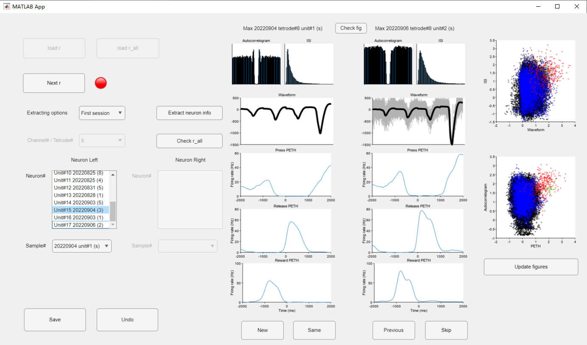
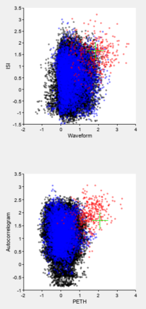
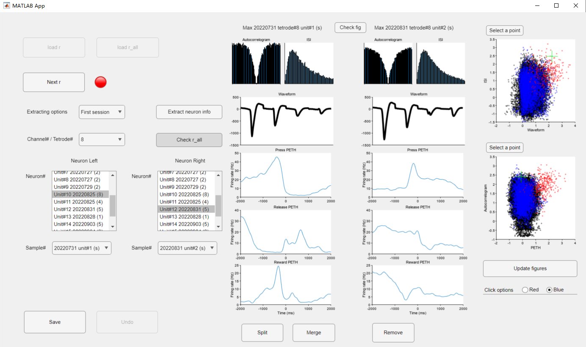
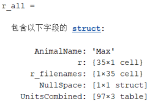
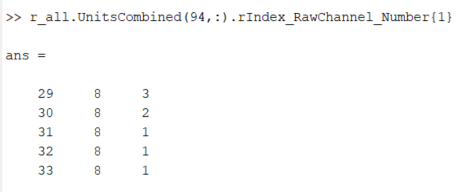
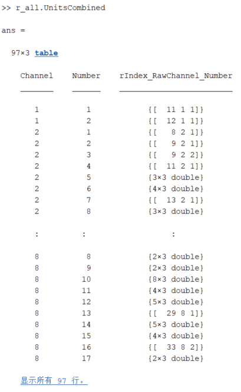

# findSameNeurons
A MATLAB app to find the same unit in different sessions.  
2023/5/10 by Yue Huang

## Prerequisites
- App and all realated MATLAB functions (can be found in github)
- MATLAB 2022b or later
- A folder containing all related `RTarrayAll.mat`

## How to use
1. Open the app

2. Press `Load r` button to load all `RTarrayAll.mat` files in the folder or press `Load r_all` button to load existing `r_all`

3. Press `Extract neuron info` to extract the necessary information of the neurons, which would be used in the App

4. Check whether the 2 single units are the same

- Use Waveform, ISI, Autocorrelogram and PETH to check whether the 2 units are the same
- The 2 figures on the right are about the similarity of the 2 units  
   

| Marker | Notes |  
| :------------- | :------------ |  
|'+'| the similarity of current pairs of units|  
|Black points|Null space. The similarity of all pairs of units from different channels or same sessions|  
|Blue points|The similarity of pairs of units from the same channel and marked as different units|  
|Red points|The similarity of pairs of units marked as the same units|  
- Press `Check fig` button to open the `PETH` created by function `SRTSpikesV5_unsorted`
- Press `Same` button to mark the 2 units as the same
- Press `New` button to mark the 2 units as not the same
- Press `Skip` button to skip the `Neuron B`
- Press `Previous` button to go back to the previous unlabeled `Neuron B`
- Scroll up/down or click in the `Neuron A Listbox` to check another pairs of units
    - For example, `Unit#2 20220817 (3)` means it is the 2nd unit in the channel from `r_all`. This unit appeared in 3 different sessions, and the last session is `20220817`
    - `Sample dropdown` is used to select the session when the unit appeared. `20220817 Unit#2 (s)` means it is the 2nd unit in the session `20220817` and it is a single unit
- Press `Undo` button or `Ctrl + Z` to undo the last operation

5. Press `Next r` to check the units in the next `RTarrayAll.mat` file
- The lamp will be green if the last unit in the current `RTarrayAll.mat` file is labeled
- Skipped units cannot be recovered after pressing `Next r`

6. Press `Check r_all` to examine the labeled units  

- Select the channel or tetrode
- To select pairs of units, you can click in the `Neuron A Listbox` and `Neuron B Listbox` or press `Select a point` button and click in the figures on the right
- Set the options of click. Choosing `Red` to select only the red points that is marked as same units. Choosing `Blue` to select only the blue points that is marked as different units.
- Press `Split` button to split the selected unit on the right (only the selected session) as a new unit
- Press `Merge` button to merge the selected unit on the right (only the selected session) to the unit on the left
- Press `Remove` button to remove the selected unit on the right and cannot be recovered

7. Save the result
- Press `Save` button to save the result (`r_all.mat`) or save when exitting the app
- Rename the output file to aviod overwriting the result

8. Post processing
- For example, use `updateDepthDose.mlx` to update the DCZ dose and the depth of each unit

## About `r_all.mat`
 
  


  
| Field name | Format | Notes |  
| :------------- | :------------ | :------------ | 
|AnimalName|char|Animal name|  
|r|nx1 cell|Each `r` is same as original `r` except `r.Units.SpikeTimes.wave` contains only the mean waveform|  
|r_filenames|1xn cell|The full path of `RTarrayAll.mat`|  
|NullSpace|Struct|The coordinates of each "black" point|
|UnitsCombined|table|Each row is an unique unit|
|UnitsCombined.Channel|1x1 double|The Unit# or Tetrode#|
|UnitsCombined.Number|1x1 double|The number of the unit in the channel|
|UnitsCombined.rIndex_RawChannel_Number|1x1 cell and nx3 double inside|n is the number of sessions that the unit appeared. The first column is the index of `r_all`, the second column is the raw channel number and the third column is the unit number in the raw channel|

## About similarity

### Waveform similarity
```
cc = corrcoef(x1, x2); % x is the mean waveform
similarity = atanh(cc(1, 2));
```

### Autocorrelogram similarity
```
binwidth = 1; % ms
window = 50; % ms
[c, lag] = xcorr(binned_spike_times, binned_spike_times, round(window/binwidth));
c(lag==0)=0;
```
```
x1 = x1./max(x1); % x is the autocorrelogram. Scale the upper to 1.
x2 = x2./max(x2);
cc = corrcoef(x1, x2);
similarity = atanh(cc(1, 2));
```
### ISI similarity
```
isi = diff(spike_times);
isi_hist = histcounts(isi,'BinLimits',[0,100],'BinWidth',1);
isi_freq = isi_hist./sum(isi_hist);
```
```
cc = corrcoef(x1, x2); % x is isi_freq
out = atanh(cc(1, 2));   
```

### PETH
```
idx_press = find(strcmp(r_this.Behavior.Labels,'LeverPress'));
idx_release = find(strcmp(r_this.Behavior.Labels,'LeverRelease'));
idx_reward = find(strcmp(r_this.Behavior.Labels,'ValveOnset'));
idx_correct = r_this.Behavior.CorrectIndex;

press_times = r_this.Behavior.EventTimings(r_this.Behavior.EventMarkers==idx_press);
release_times = r_this.Behavior.EventTimings(r_this.Behavior.EventMarkers==idx_release);
reward_times = r_this.Behavior.EventTimings(r_this.Behavior.EventMarkers==idx_reward);

press_times = press_times(idx_correct);
release_times = release_times(idx_correct);

% only consider the first session (before drug injection)
press_times = press_times(press_times<t_end_control);
release_times = release_times(release_times<t_end_control);
reward_times = reward_times(reward_times<t_end_control);

params.pre = 1000;
params.post = 1000;
params.binwidth = 10;

params_press = params;
params_release = params;
params_release.post = 500;
params_reward = params;
params_reward.pre = 500;

gaussian_kernel = 5; % ms

PETH_press = jpsth(spike_times, press_times, params_press);
PETH_release = jpsth(spike_times, release_times, params_release);
PETH_reward = jpsth(spike_times, reward_times, params_reward);
PETH_press = smoothdata(PETH_press,'gaussian',gaussian_kernel*5);
PETH_release = smoothdata(PETH_release,'gaussian',gaussian_kernel*5);
PETH_reward = smoothdata(PETH_reward,'gaussian',gaussian_kernel*5);

PETH_all = [PETH_press, PETH_release, PETH_reward];
```

```
cc = corrcoef(x1, x2); % x is PETH_all
out = atanh(cc(1, 2));   
```


