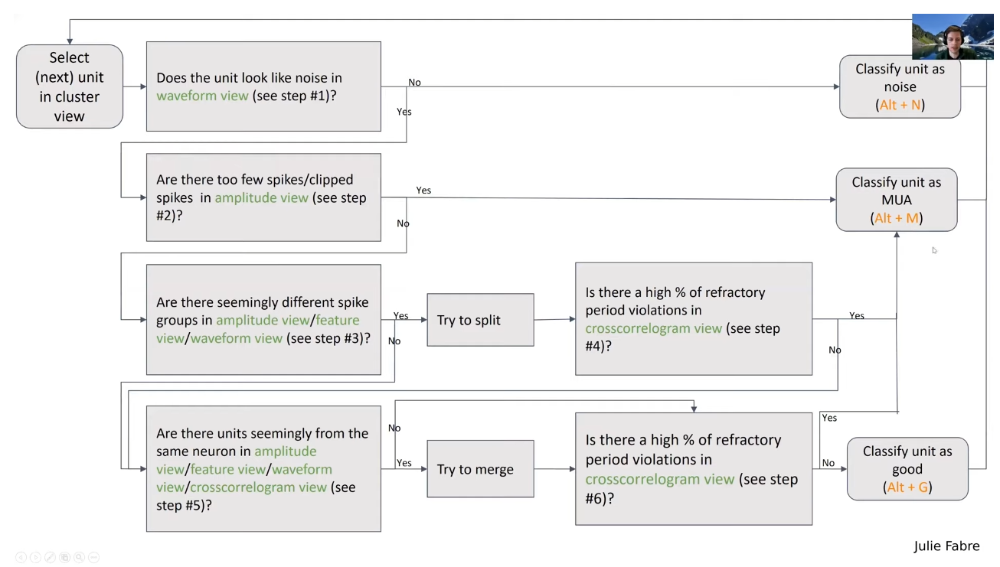

# Kilosort with BlackRock Recording

<!-- START doctoc generated TOC please keep comment here to allow auto update -->
<!-- DON'T EDIT THIS SECTION, INSTEAD RE-RUN doctoc TO UPDATE -->
- [Kilosort with BlackRock Recording](#kilosort-with-blackrock-recording)
  - [Installation](#installation)
    - [prerequesite:](#prerequesite)
    - [Steps](#steps)
  - [Data process pipeline](#data-process-pipeline)
    - [About Phy output files](#about-phy-output-files)

<!-- END doctoc generated TOC please keep comment here to allow auto update -->
## Installation
### prerequesite:
- [Visual studio community 2017](https://visualstudio.microsoft.com/zh-hans/vs/older-downloads/) with 'C++桌面开发' (compatatible to MATLAB version, check it [here](https://www.mathworks.com/support/requirements/previous-releases.html))
- MATLAB + necessory toolboxes + MEX
- [kilosort3](https://github.com/MouseLand/Kilosort) or [kilosort2_5](https://github.com/MouseLand/Kilosort/releases/tag/v2.5) (place in a proper directory)
- [npy-matlab](https://github.com/kwikteam/npy-matlab) (place in a proper directory and better save it in MATLAB path)
- Anaconda

### Steps
#### Install phy
- New conda environment with python 3.8 `conda create -n phy python=3.8`
- Activate the new environment `conda activate phy`
- Install phy `pip install phy --pre --upgrade`
- Deal with numpy version error `pip uninstall numpy`, `pip install numpy==1.23`
#### Install spike interface
- New conda environment with python 3.8 `conda create -n spikeinterface python=3.8`
- Activate the new environment `conda activate spikeinterface`
- Install spikeinterface `pip install spikeinterface[full,widgets]`
#### Install kilosort
- Install kilosort. If visual studio is properly installed, run `mex -setup C++` in MATLAB and run the file `Kilosort\CUDA\mexGPUall.m`.
#### Install kilosort plugins
- See [here](https://github.com/jiumao2/PhyWaveformPlugin)
- Purpose: remove strange waveforms in phy. Phy does not provide direct access to curating on waveforms (for it is slow to extract the waveforms). The sorting output usually contains noisy waveforms. It is more convenient to directly remove the noise in a single view.

## Data process pipeline
- Move the directory with your data to SSD. (faster)
- Move the file `kilosort.ipynb` to your data directory (`kilosortTetrodes.ipynb` for tetrodes).
- Open `kilosort.ipynb` in VS Code and set the kernal to `spikeinterface`. Modify the codes by following the instructions. Confirm that the path to kilosort, the kilosort version, the channel map and the sessions are correct.
- Do munual curation with [Phy](https://phy.readthedocs.io/en/latest/clustering/). Open 'Anaconda prompt'. First enter the output directory and run `phy template-gui params.py`.
- Following the pipeline. Watch phy tutorial [here](https://www.youtube.com/watch?v=czdwIr-v5Yc). 
- Copy `BuildSpikeTable.m` (`BuildSpikeTableTetrodes.m` for tetrodes) to data folder, edit key parameters and run. A new class object `KilosortOuput` will be generated. 
- Run `KilosortOutput.BuildR()` to build `r`.


### [About Phy output files](https://github.com/cortex-lab/phy/blob/master/docs/sorting_user_guide.md#datasets)
| Filename | Type | Notes |
| :------------- | :---------- | :------------ |
|spike_clusters.npy|	nx1 vector 	                                    |Each spike's cluster (0:n_cluster-1) after manual curation |
|spike_templates.npy| 	nx1 vector 		                                |Each spike's cluster (0:n_cluster-1) before manual curation|
|spike_times.npy| 		nx1 vector 		                                |Unit: 1/30000 sec (1/sampling_frequency)|
|templates.npy| 		n_clusterxlength_waveform(82)xn_channel matrix.||
|templates_ind.npy| 	n_clusterxn_channel matrix 	                    |templates_ind(1,:) -> [0:31]|
|amplitudes.npy| 		nx1 vector 		                                |Unit: 40*mV?|
|channel_map.npy| 		n_channelx1 vector 	                            |0:31|
|channel_positions.npy| n_channelx2 vector 	                            |Position of each channel. Unit: μm|
|similar_templates.npy| n_clusterxn_cluster matrix 	                    |Similarity matrix|
|cluster_group.tsv|		mx2 table		                                |The manually modified info about the group (good/MUA/noise)|
|cluster_info.tsv|		n_clusterxn_property table	                    |Raw cluster info. Cluster info (cluster_idx, group) will be changed by manual curation|
|cluster_KSLabel.tsv|	n_clusterx2 table		                        |Raw group info|
|chanMap.mat|           struct                                          |Information about the probe|
|ops.mat|               struct                                          |Kilosort parameters|
|recording.dat|         binary data                                     |Raw recording data|
|temp_wh.dat|           binary data                                     |Filtered recording data|

### References
- [Tetrodes channel map](https://github.com/MouseLand/Kilosort/issues/51) and [Tetrodes sorting parameters](https://github.com/MouseLand/Kilosort/issues/95)

### Troubleshooting
1. CUDA 'invalid configuration' errors
```
An unexpected error occurred trying to launch a kernel. The CUDA error was:
invalid configuration argument
```
- See solution [here](https://github.com/MouseLand/Kilosort/issues/427).  

for extract spikes:
```
try
    st(5,:) = cF;
catch 
    st = [st; cF];
end
```
for template learning:
```
try
    ich = unique(iC(:, itemp));
catch
    tmpS = iC(:, itemp);
    ich = unique(tmpS);
end
```

2. GPU out of memory
```
Out of memory on device. To view more detail about available memory on the GPU, use 'gpuDevice()'. If the problem persists, reset the GPU by
calling 'gpuDevice(1)'.
```
- Solution: do not use GPU in that step.  

For example, comment out the following code in `align_block2.m`:
```
Fg = gpuArray(single(F));
```

3. Wrong best channel in phy  

Sometimes phy marks wrong best channel. We would see beautiful autocorrelogram and ISI histogram but small waveforms.  

Solution 1 (Recommended):  
-  Use the updated [plugin](https://github.com/jiumao2/PhyWaveformPlugin). This plugin automatically selects the channel with largest amplitude in SingleWaveformView and allows you to change the channel ID in the view.  
- Relabeled the best channel afterwards in `BuildSpikeTable.m` if necessary.
```
spikeTable([spikeTable.cluster_id]==cluster_id,:).ch = real_best_channel;
```
  
Solution 2 (Not Recommended):
- Marked this unit as `mua` and find out the best channel of this unit after spike sorting.
- Return to phy and and select the channel to clear noise.
- Relabeled the best channel afterwards in `BuildSpikeTable.m` if necessary.
```
spikeTable([spikeTable.cluster_id]==cluster_id,:).ch = real_best_channel;
```

4. Cannot open phy  
- Check whether the path in `params.py` is right, especially after you move your data to another computer.
- Remove the directory `.phy`. Never copy this directory when transferring your data.

5. No good units after kilosort or missing spikes
- Try to lower the spike detection threshold. Modify the sorting parameters in `kilosort.ipynb`. For example, add `sorted_params['projection_threshold'] = [8,3]`.

6. Cannot run Kilosort in Vscode  
- There are 2 options:  
(1) Run in the jupyter  
(2) Change the encoding of terminal to `utf-8`: 设置-语言和时间-语言-管理语言设置-更改系统区域设置-Beta版：使用Unicode UTF-8提供全球语言支持-确定-重新启动电脑
