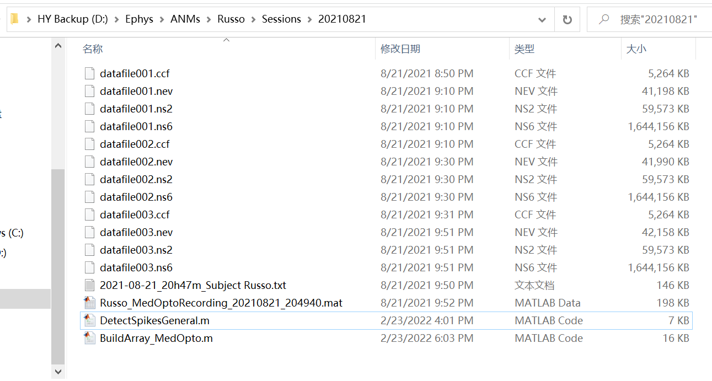
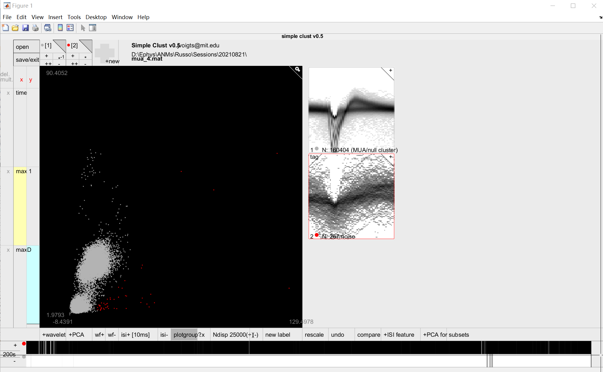
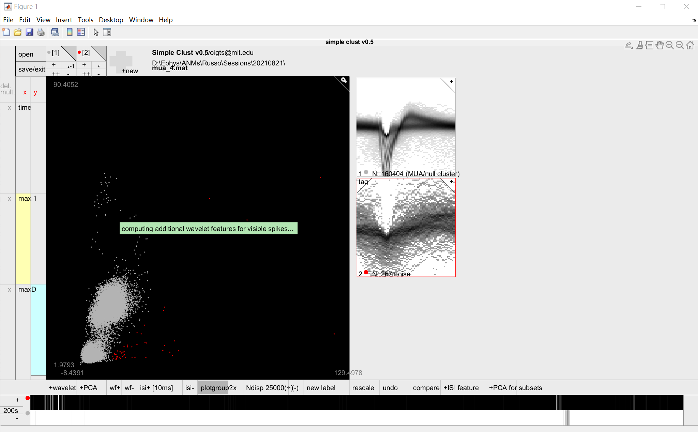
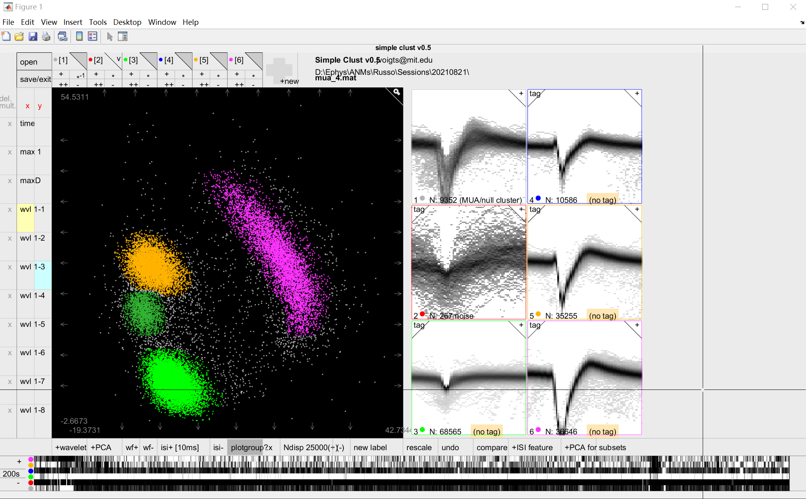
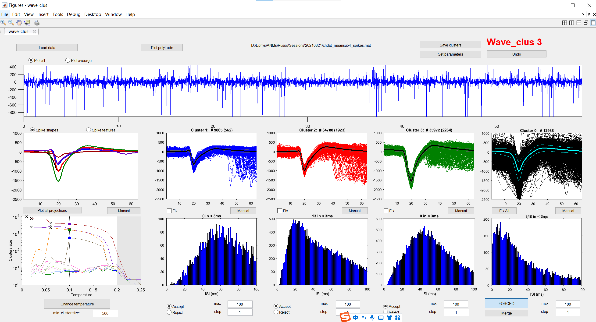
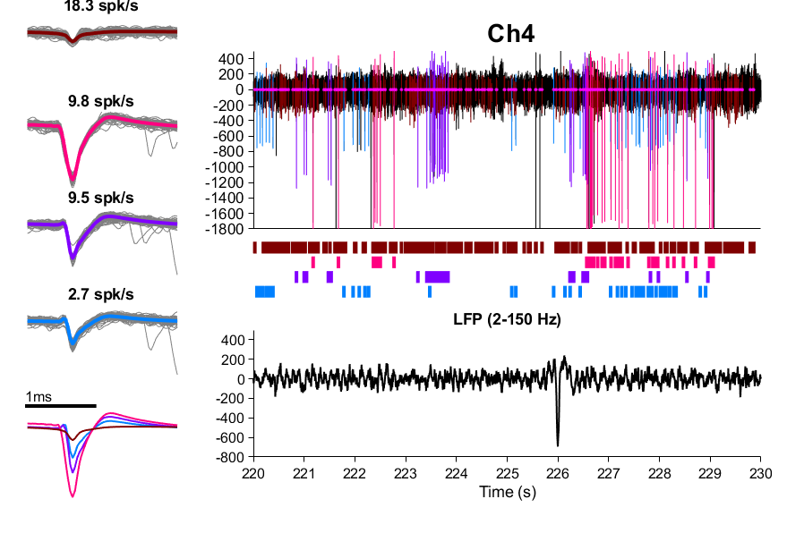
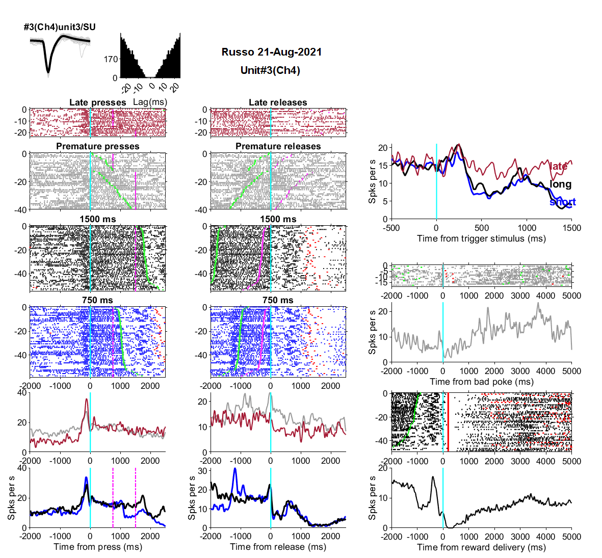
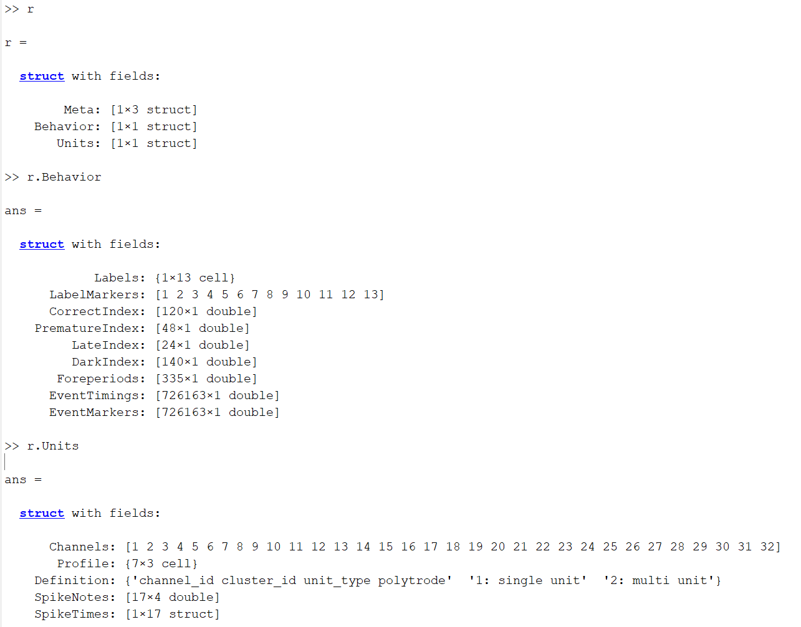
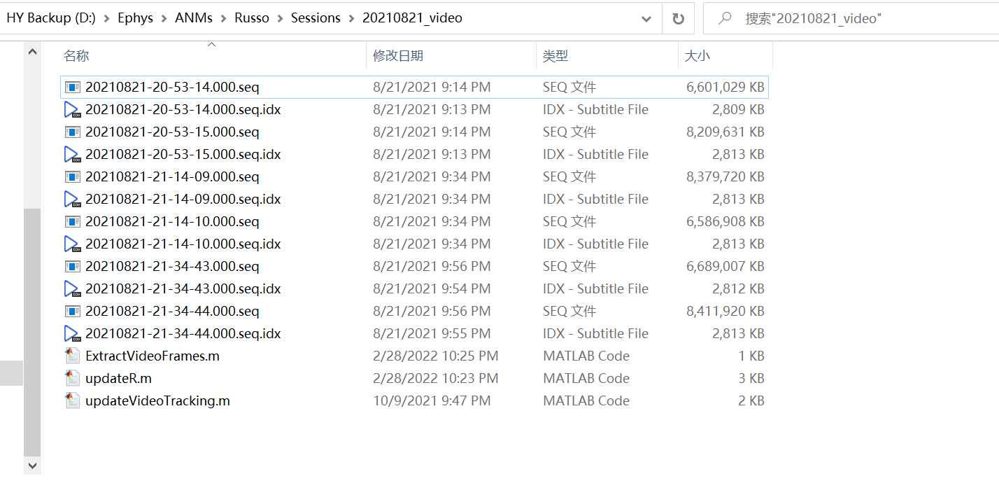

# Electrophysiology Data Analysis Pipeline
<!-- START doctoc generated TOC please keep comment here to allow auto update -->
<!-- DON'T EDIT THIS SECTION, INSTEAD RE-RUN doctoc TO UPDATE -->

- [Electrophysiology Data Analysis Pipeline](#electrophysiology-data-analysis-pipeline)
  - [Overview](#overview)
    - [Necessary Files](#necessary-files)
  - [Pipeline of Analyzing Data From Single Session](#pipeline-of-analyzing-data-from-single-session)
    - [Spike Sorting](#spike-sorting)
      - [Place Files Properly](#place-files-properly)
      - [Spike Detection](#spike-detection)
      - [Simple Clust](#simple-clust)
      - [Double Checking](#double-checking)
    - [PSTH](#psth)
    - [Video Analysis](#video-analysis)
      - [Place Files Properly](#place-files-properly-1)
      - [Get Timestamps Of Each Frame](#get-timestamps-of-each-frame)
      - [Make Video Clips](#make-video-clips)
      - [Extracting Frames When Neuron Bursts (high firing rate)](#extracting-frames-when-neuron-bursts-high-firing-rate)
      - [Extracting Frames With Raster Plot](#extracting-frames-with-raster-plot)
      - [Encoding Analysis: Generalized Linear Model](#encoding-analysis-generalized-linear-model)
    - [Tracking Analysis](#tracking-analysis)
      - [DeepLabCut](#deeplabcut)
  - [Pipeline of Analyzing Data From Multiple Sessions](#pipeline-of-analyzing-data-from-multiple-sessions)

<!-- END doctoc generated TOC please keep comment here to allow auto update -->

## Overview
### Necessary Files
- Ephys: datafile00x.ccf & datafile00x.nev & datafile00x.ns2 & datafile00x.ns6
- MED: xxx.txt (SRT_Step7_FR1_TwoFPsMixedBpod)
- Bpod: xxx.mat (MedOptoRecording)
- Video: xxx.seq & xxx.seq.idx

## Pipeline of Analyzing Data From Single Session

### Spike Sorting  
#### Place Files Properly  
- Include all [Ephys/Med/Bpod file](#necessary-files), `DetectSpikesGeneral.m` and `BuildArray_MedOpto.m` in a single folder  
- `DetectSpikesGeneral.m` and `BuildArray_MedOpto.m` can be found in `.\CodesHY\Scripts`

#### Spike Detection  
- `openNEV` open xxx.nev  
- `CheckNEVSpikes(NEV)` check waveforms and choose good channels  
- Edit the variable `LiveChs` (line 22) based on online sorting and the chosen channels  
- Edit the variable `pos_detection` (line 158) based on online sorting  
- Run `DetectSpikesGeneral.m`. It need a few hours.  
- Gernerated Files:
  - `chdatx.mat`: the raw recording from channel x
  - `ForceSensor.mat`: the raw recording about the lever pressure. It is not the real force on the lever.
  - `CommonAvgData.mat`: mean recording of all `LiveChs` channels
  - `chdat_meansubx.mat`: raw recording from channel x is subtracted by mean recording `CommonAvgData.mat`, and then passed through a 4th-order Elliptic band-pass filter which passes frequencies between 250Hz and 8000Hz, and with 0.1 dB of ripple in the passband, and 40 dB of attenuation in the stopband (`ellip(4,0.1,40,[250 8000]*2/Fs);`)  
  - `chdat_meansubx_spikes.mat`: Spike detection data, the result from `chdat_meansubx.mat` going through `Get_spikes`. Saves spikes, spike times (in ms), used parameters and a sample segment of the continuous data.
  - `times_chdat_meansubx.mat`: Auto-clustering data, the result from `chdat_meansubx_spikes.mat` going through `Do_clustering`. Saves spikes, spike times (in ms), coefficients used (inspk), used parameters, random spikes selected for clustering (ipermut) and results (cluster_class)  
  - `mua_x.mat`: unclustered data converted from `times_chdat_meansubx.mat`, which can be opened by SimpleClust. Run `mua2wave_clust('x')` or `wave_clust2mua('x')` to convert these 2 kinds of data  
#### Simple Clust  
- Run `jsimpleclust`

  - open `mua_x.mat`
  - select all points that are noise or not spikes of interest  
  
  - click '+wavelet'. This step takes about 3 minutes  
  
  - select different waveforms based on multiple features  
  
  - removing "bad" waveforms  based on multiple features
  - save and exit
  - tips:
    - Since '+wavelet' step need a few time, you can open more MATLAB for efficiency
    - You can open `chx_simpleclust.mat` to check your previously clustered data
#### Double Checking
- Run `mua2wave_clust('x')` to converted `chx_simpleclust.mat` back to `times_chdat_meansubx.mat` and `chdat_meansubx_spikes.mat`
- Run `wc` and `celestina`
  - load `chdat_meansubx_spikes.mat`
  - manually clear the abnormal waveforms and reject the noisy clustered
  
  - click 'Save clusters' !!!
  - click 'load from GUI' in celestina. Check whether a cluster is a single unit and whether 2 clusters are the same
  - run `PlotWaveClusSorting('4', 'trange', [220 230], 'spkrange', [-1800 500], 'lfprange', [-800 500])` to plot the spikes from channel 4, time from 220s to 230s, spike y axis ranging from -1800mV to 500mV and LFP y-axis ranging from -800mV to 500mV  
    

### PSTH
- Open `BuildArray_MedOpto.m`. Edit `name`, `blocks` and `units`. Determine whether a unit is a single unit by ISIH (Interspike Interval Histogram) in wc (usually less than 1% in < 3ms).
- Run `BuildArray_MedOpto.m`. Select the thresholds as instructed. And then PSTH of all units will be plot and saved in `./Fig/`
    
- `RTarrayAll.mat` will save all the behavioral and electrophysiological data.  

- The meaning of fields in `r`:  
  - Meta: the meta information of each block
  - Behavior: behavioral data
    - Labels: the meaning of each label marker
    - CorrectIndex/PrematureIndex/LateIndex/DarkIndex: the index of correct/premature/late/dark trial. Each trial corresponds to each press.
    - Foreperiod: the forperiod of each trial
    - Some trials (presses) are not categorized into either class (correct/premature/late/dark)
    - EventMarkers/EventTimings: the timings of each event
  - Units: electrophysilogical data
    - Profile: the units in each channel
    - SpikeNotes/Definition: `Definition` defines the `SpikeNotes`
    - SpikeTimes: the spike time and the waveform of each spike
### Video Analysis
#### Place Files Properly  
- Include all [Video files](#necessary-files), `ExtractVideoFrames.m`, `updateR.m` and `updateVideoTracking.m` in a single folder  
- `ExtractVideoFrames.m`, `updateR.m` and `updateVideoTracking.m` can be found in `.\CodesHY\Scripts`

#### Get Timestamps Of Each Frame
- Open `ExtractVideoFrames.m`. Edit `topviews` and `sideviews`.
- Run `ExtractVideoFrames.m`. `timestamps.mat` which contains timestamps of each frame will be saved.
#### Make Video Clips
- Open `UpdateR.m`. Edit the path of `RTarrayAll.mat`, `fr` and `video_length`.
- Edit this line `ExtractEventFrameSignalVideo(r, ts, [], 'events', 'Press', 'time_range', [2100 2400], 'makemov', 1, 'camview', 'top', 'make_video_with_spikes', false, 'sort_by_unit',true,'frame_rate',10,'start_trial',1);` in the last section according to your request
- Run `UpdateR.m`. A new directory `./VideoFrame_top/` or `./VideoFrame_side/` will be generated.  
  - `./VideoFrame_top/MatFile/`: the information about each video clip
  - `./VideoFrame_top/RawVideo`: all the raw video clips  
  A New `r` will be saved. `r.VideoInfos_top` merge the information in `./VideoFrame_top/MatFile/`
#### Extracting Frames When Neuron Bursts (high firing rate)
- `ExtractBurstFrame(r,1,'view','top')` it will generate `./VideoFrame_top/BurstFrame/Unit1.avi`, which contains the 1000 (or more) frames when the unit has highest firing rate  
#### Extracting Frames With Raster Plot
- Copy `.\CodesHY\Scripts\MakeRasterPlotVideo.m` to the current directory (xxx_video)
- Edit `camview`.
- Run `MakeRasterPlotVideo.m`. Raw video with raster plot will be generated in `./VideoFrame_camview/Video`  
<video src='./readme/Press001.avi'> </video>
#### Encoding Analysis: Generalized Linear Model

### Tracking Analysis

#### DeepLabCut

## Pipeline of Analyzing Data From Multiple Sessions
  
